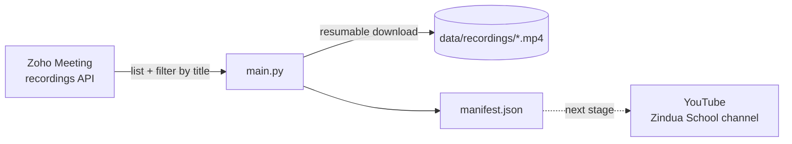

# 🎥 Zoho Recording Downloader


Pull **Zindua School** class recordings (e.g. **PyData 26H**) out of Zoho Meeting and onto
your disk — filtered by title, resumable, and never downloaded twice.



---

## ✨ Features

- **Finds every recording** in your Zoho Meeting org (handles pagination)
- **Filters by title** with a regex — defaults to `Pydata26H` sessions
- **Resumable downloads** — interrupted files pick up where they left off
- **Idempotent** — re-run anytime; finished files are skipped
- **Manifest** with a ready-made YouTube title/description per video, for the upload stage
- Runs anywhere: **uv** on Linux/macOS/WSL, **Docker** on Windows

---

## 🚀 Quick start

```sh
git clone https://github.com/Rohianon/zoho-recording-downloader.git
cd zoho-recording-downloader
cp .env.example .env        # then fill in credentials (see below)
make install
make list                   # see what matches
make download               # fetch it
```

> No `make`? Every target is a thin wrapper — use the `uv run` commands in the [usage table](#-usage).
> On Windows, use [Docker](#-docker-windows--macos).

---

## 🔑 Zoho credentials (one-time)

1. Open the [Zoho API Console](https://api-console.zoho.com) → **Add Client** → **Self Client**.
2. From the **Client Secret** tab, copy the ID and secret into `.env`:
   ```ini
   ZOHO_CLIENT_ID=1000.xxxxxxxx
   ZOHO_CLIENT_SECRET=xxxxxxxx
   ```
3. Print the scopes and paste them into the **Generate Code** tab:
   ```sh
   make scopes
   ```
   Pick **10 minutes**, any description, then under **Select Portal → Meeting** choose the
   Zindua org and hit **Create**.
4. Exchange the code **straight away** (it's single-use and expires):
   ```sh
   make token CODE=1000.xxxxxxxx
   ```
   Paste the printed `ZOHO_REFRESH_TOKEN=...` into `.env`. It doesn't expire — you're done.

> [!TIP]
> Seeing two identical org names in the portal picker? Pick one, run `make list-all`, and if
> it's the wrong org, generate a new code with the other. Once confirmed, pin it with
> `ZOHO_ZSOID` (Zoho Meeting → Admin Settings → Organization).

---

## 📖 Usage

| What | make | uv |
|---|---|---|
| All recordings in the org | `make list-all` | `uv run main.py list -a` |
| Recordings matching `TITLE_PATTERN` | `make list` | `uv run main.py list` |
| Search by title | `make list PATTERN=pandas` | `uv run main.py list -p pandas` |
| Preview a download | `make dry-run` | `uv run main.py download -n` |
| Download | `make download` | `uv run main.py download` |
| Download a subset | `make download PATTERN=visualization` | `uv run main.py download -p visualization` |
| Run tests | `make test` | `uv run pytest` |
| All commands | `make` | `uv run main.py -h` |

A **✓** in `list` output means the recording is already on disk.

**Patterns** are case-insensitive regexes matched against the recording title:

```sh
make list PATTERN='pandas|visualization'   # either word
make list PATTERN='^26g'                   # titles starting with 26g
make list PATTERN='26h advanced'           # the Advanced ML course
```

---

## ⚙️ Configuration

All settings live in `.env` (see [`.env.example`](.env.example)).

| Variable | Default | Description |
|---|---|---|
| `ZOHO_CLIENT_ID` | — | Self Client ID **(required)** |
| `ZOHO_CLIENT_SECRET` | — | Self Client secret **(required)** |
| `ZOHO_REFRESH_TOKEN` | — | From `make token` **(required)** |
| `ZOHO_DC` | `com` | Data centre: `com`, `eu`, `in`, `com.au`, `jp` |
| `ZOHO_ZSOID` | auto | Org ID; looked up from the token if empty |
| `DOWNLOAD_DIR` | `data/recordings` | Where videos and the manifest go |
| `TITLE_PATTERN` | `pydata\s*26h` | Which recordings count as "the class" |
| `TIMEZONE` | `Africa/Nairobi` | Used for file names and descriptions |

---

## 📁 Output

```
data/recordings/
├── 2026-09-14_2012_pydata26h-pandas-001.mp4
├── 2026-09-15_2007_pydata26h-pandas-002.mp4
├── ...
└── manifest.json
```

Files are named `YYYY-MM-DD_HHMM_<title-slug>.mp4` in local time. Each manifest entry looks like:

```json
{
  "topic": "Pydata26H (Pandas 001)",
  "start": "2026-09-14T20:12:46.812000+03:00",
  "duration_mins": 73,
  "meeting_key": "1056982949",
  "file": "2026-09-14_2012_pydata26h-pandas-001.mp4",
  "bytes": 486959299,
  "downloaded_at": "2026-09-26T22:19:13.060146+03:00",
  "youtube": {
    "title": "Pydata26H (Pandas 001) | 14 Sep 2026",
    "description": "Pydata26H (Pandas 001)\nRecorded live Monday 14 September 2026, 20:12 (EAT).\nZindua School",
    "video_id": null,
    "uploaded_at": null
  }
}
```

---

## 🐳 Docker (Windows / macOS)

Only [Docker Desktop](https://www.docker.com/products/docker-desktop/) is needed. Create `.env`
first; recordings land in `./data/recordings` on your machine.

```sh
docker compose build
docker compose run --rm zoho list -a             # all recordings
docker compose run --rm zoho list -p pandas      # search by title
docker compose run --rm zoho download -n         # dry run
docker compose run --rm zoho download
```

One-time token setup:

```sh
docker compose run --rm --entrypoint python zoho scripts/get_refresh_token.py          # prints scopes
docker compose run --rm --entrypoint python zoho scripts/get_refresh_token.py <code>
```

Re-run `docker compose build` after pulling code changes.

---

## 🩺 Troubleshooting

| Symptom | Likely cause |
|---|---|
| `Could not refresh access token` | Refresh token revoked, or wrong `ZOHO_DC` for your account |
| `401` / `403` listing recordings | Missing scope, or the Zoho plan/licence doesn't allow API access |
| `Expected video, got text/html` | Download scopes missing — regenerate the code with `make scopes` output |
| Fewer recordings than the web app | Wrong org selected in the portal picker |
| A class session isn't listed | Its title doesn't match `TITLE_PATTERN` — check `make list-all` |
| Download stopped midway | Just re-run `make download`; it resumes |

---

## 🛠️ Development

```
main.py        CLI entry point (list / download)
models/        pydantic models: Settings, Recording, ManifestEntry
services/      zoho_meeting (API client), recordings (filter + download), manifest
scripts/       one-off tools: get_refresh_token.py
tests/         pytest — Zoho HTTP mocked with `responses`
data/          gitignored output
```

```sh
make install && make test
```

---

## 🗺️ Roadmap

- [x] List, filter and download Zoho Meeting recordings
- [x] Resumable downloads + manifest
- [x] Docker support
- [ ] Upload to the Zindua School YouTube channel (playlist per class)
- [ ] Scheduled sync after each class
- [ ] Webinar recordings
